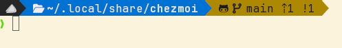
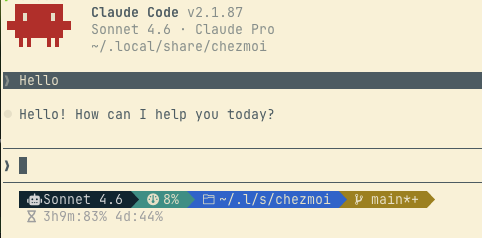

# My Dot Files

[Chezmoi](https://www.chezmoi.io/) managed dotfiles for my development environment.

## What's Managed

### Shell — Zsh
- Environment variables (`~/.zshenv`)
- Modular config loaded via [antidote](https://getantidote.github.io/) plugin manager
- Plugins: powerlevel10k prompt, zsh-autosuggestions, zsh-completions
- Aliases: `ls` → eza, `ll` → eza detailed listing
- Integrations: zoxide (smart `cd`), asdf (runtime version manager), ghostty shell integration



### Terminal — Ghostty
- Shell integration with zsh
- Light/dark Selenized theme
- Keybindings for split creation and navigation

### Editor — Neovim
Lua-based config using [lazy.nvim](https://github.com/folke/lazy.nvim).

### Claude Code
- Global `CLAUDE.md` instructions template
- Custom status line scripts
- Settings, agents, commands, and skills directories



### Packages
A run-on-change script installs system packages via `pacman`/`yay` on Linux or `brew` on macOS:

- **neovim** — editor
- **ghostty** — terminal
- **zsh** + **zsh-antidote** — shell and plugin manager
- **asdf** — runtime version manager
- **eza** — modern `ls`
- **fd** — fast file finder
- **fzf** — fuzzy finder
- **ripgrep** — fast grep
- **zoxide** — smart directory jumping
- **Monaspace Nerd Font** — font

## Setup

```sh
chezmoi init --apply https://github.com/aaron-edwards/dotfiles
```

## How It Works

- **Templates** (`.tmpl` files) handle OS- and machine-specific config (personal vs. work)
- **`private_` prefix** marks sensitive files for chezmoi encryption
- **`run_onchange_before_`** scripts run only when their content changes
