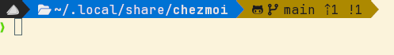
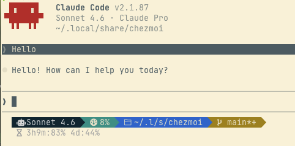

# My Dot Files

[Chezmoi](https://www.chezmoi.io/) managed dotfiles for my development environment.

## What's Managed

### Shell — Zsh
- Environment variables (`~/.zshenv`)
- Modular config loaded via [antidote](https://getantidote.github.io/) plugin manager
- Plugins: powerlevel10k prompt, zsh-autosuggestions, zsh-completions
- Aliases: `ls` → eza, `ll` → eza detailed listing
- Integrations: zoxide (smart `cd`), fzf (fuzzy finder), asdf (runtime version manager), ghostty shell integration



### Terminal — Ghostty
- Shell integration with zsh
- Light/dark Selenized theme
- Keybindings for split creation and navigation

### Editor — Neovim
Lua-based config using [lazy.nvim](https://github.com/folke/lazy.nvim).

### Claude Code
- Global `CLAUDE.md` instructions template
- Custom status line scripts
- Settings, agents, commands, and skills directories



### Packages
A run-on-change script installs system packages via `pacman`/`yay` on Linux or `brew` on macOS:

- **neovim** — editor
- **ghostty** — terminal
- **zsh** + **zsh-antidote** — shell and plugin manager
- **asdf** — runtime version manager
- **eza** — modern `ls`
- **fd** — fast file finder
- **fzf** — fuzzy finder
- **ripgrep** — fast grep
- **zoxide** — smart directory jumping
- **gh** — GitHub CLI
- **jq** — JSON processor
- **Monaspace Nerd Font** — font

### Git
- Global config (name, email, rebase, prune, etc.) applied via configure script
- Global `.gitignore` at `~/.gitignore_global` covering `.DS_Store`, swap files, `.env`, logs

### Node.js (via asdf)
- Latest LTS version installed automatically on first run
- Corepack enabled (provides `yarn`/`pnpm` shims)

## Setup

```sh
chezmoi init --apply git@github.com:aaron-edwards/dotfiles.git
```

On first apply, chezmoi will:
1. Install system packages
2. Apply git and macOS configuration
3. Bootstrap Neovim plugins (lazy.nvim)
4. Install Node.js LTS via asdf with corepack enabled
5. Print a checklist of remaining manual steps

## How It Works

- **Templates** (`.tmpl` files) handle OS- and machine-specific config
- **`private_` prefix** marks sensitive files for chezmoi encryption
- **`run_onchange_before_`** scripts run only when their content changes
- **`run_once_after_`** scripts run once on a new machine (bootstrapping)
